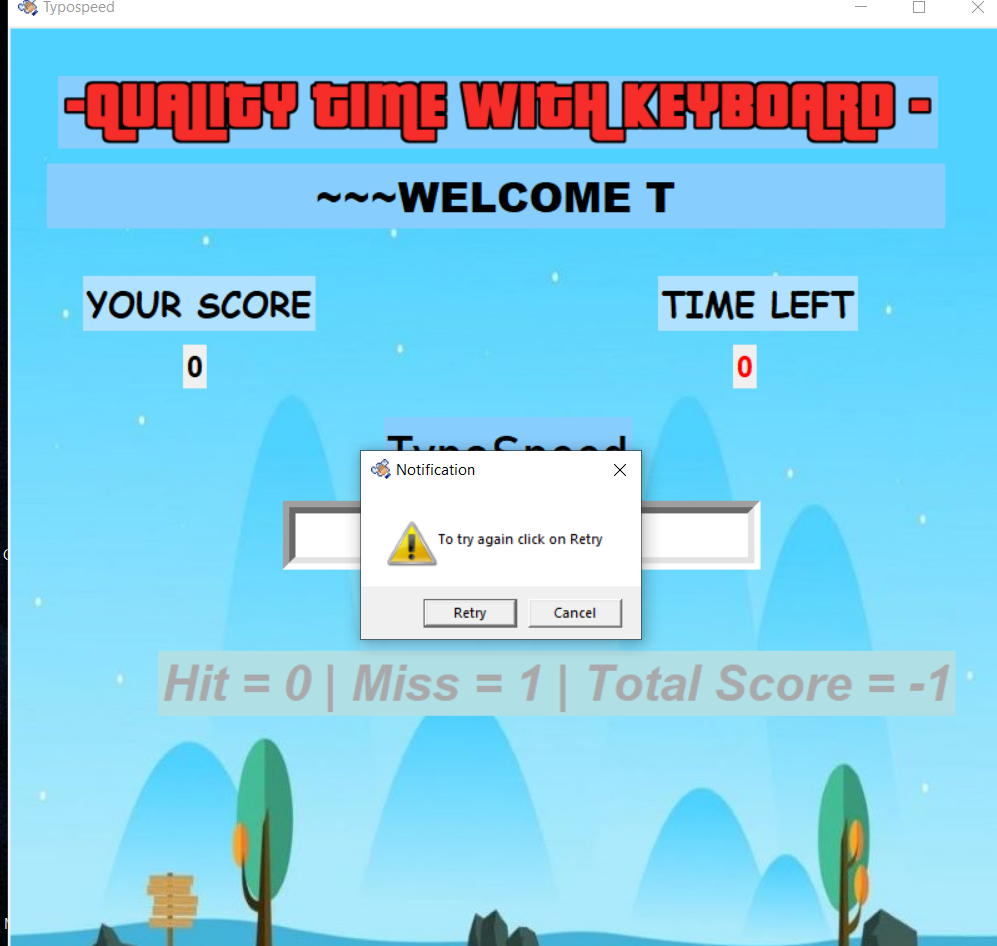

# TypoSpeed

<i>README of Typo speed</i>

## SPEED TYPING TEST using python
## Prerequisites

#### Python 3.6+

## Commands to Check Versions

#### Python- `python --version`
## Descriptions
#####  as we all know that in today's world we all have to use PCs for our work from home scenario and also there are a lot of coding related fields developing nowadays so it is really imp to type fast so as to do the task as early as possible. That's why we have come up with a speed typing test which runs a timer of 60 sec and gives you no. of hits and misses at the end of 60 sec
## Installation:
#### 1 ) Click on the Typospeed-1.0-amd64.msi , the setup file for installing the TypoSpeed app .
#### 2 ) Download the 12.1 MB setup file from the repository ITW_Project1 . 
#### 3 ) Now the TypoSpeed GUI app will be shown in the Desktop.
#### 4 ) Now click on the icon to start the game !!

## Usage: 
- 1 ) You will be given 60 seconds and random words will be displayed on the screen.
- 2 ) You need to type it in the box given and hit 'Enter' key accordingly.
- 3 ) As soon as you hit enter first time the clock will start running from 60 sec to 0 sec
- 4 ) At the end your complete score will be displayed after when 60 sec will be over!
- 5 ) A message box will also appear , having buttons to 'retry' or 'cancel' . 
###  PREVIEW

### Credits:
  - STACKOVERFLOW
  - geeks for geeks
  
